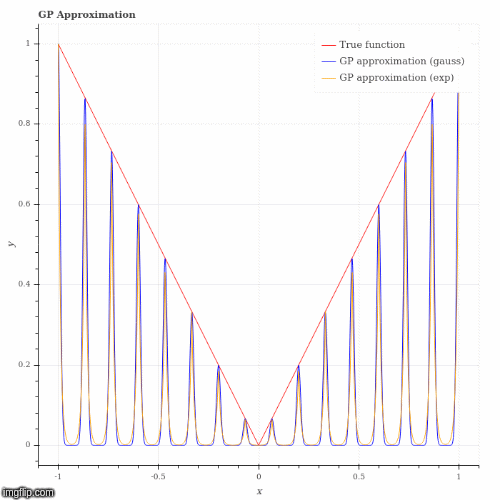
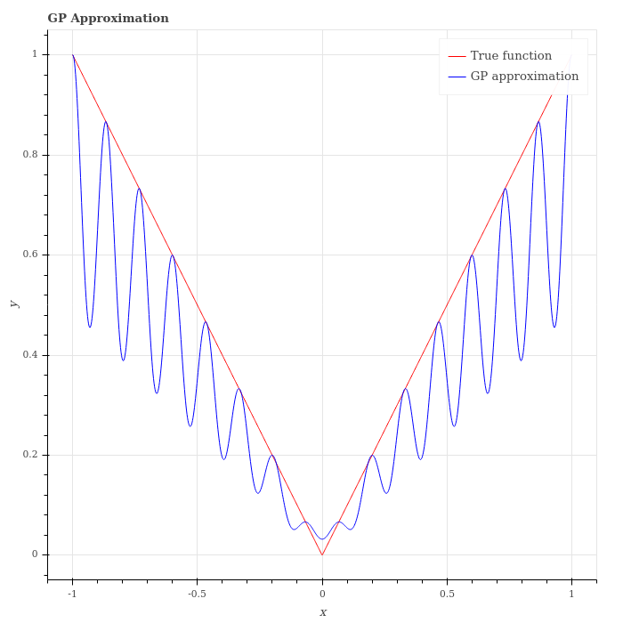
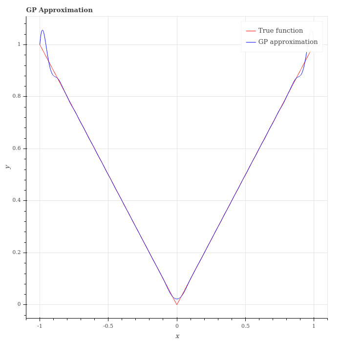

# gp_approx_app

Bokeh-powered web app to visualize approximation of continuous functions over a compact interval by a sequence of Gaussian functions, following the representer theorem/GP regression formula.

Available examples:
* Absolute value,
* Realization of Brownian motion.

To run the app :
* clone the repo
* run bokeh serve --show gp_approx_app/

Have fun!

### 16 points, increasing scale

     
### 16 points

     

### 32 points

